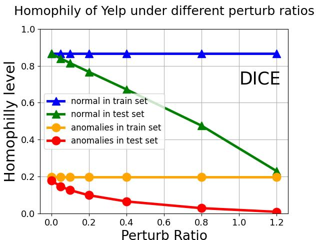

# Revisiting Attack-caused Structural Distribution Shift in Graph Anomaly Detection
Pytorch Implementation of

Revisiting Attack-caused Structural Distribution Shift in Graph Anomaly Detection

# Overview
Our [preliminary version](https://github.com/blacksingular/wsdm_GDN) observe that the heterophily degree is different across the training and test environments in GAD, leading to the poor generalization of the classifier, which is called structural distribution shift. We use GDN to solve this SDS problem from a feature view in our previous work.
In this work, we further investigates the causes of SDS and discover that graph adversarial attacks can also lead to and amplify the heterophily difference across training and testing data. We also improve our architecture with a better regularizer Sinkhorn-loss (SKL) to replace the previous KL-divergence. Apart from the implementations of the architecture GDN, we notice that current research starts to solve GAD in the spectral domain, we also try to analyze the principle of our method from the perspective of the spectral domain, so as to prove the rationality of GDN. Finally, we additionally extend our experiments to two latest real-world homogeneous graphs proposed recently.


<h2 align="center">
<figure> </figure>
</h2>

Visualization of SDS under different perturb ratio of graph adversarial attack.

# Dataset
YelpChi and Amazon can be downloaded from [here](https://github.com/YingtongDou/CARE-GNN/tree/master/data) or [dgl.data.FraudDataset](https://docs.dgl.ai/api/python/dgl.data.html#fraud-dataset). T-Finance and T-Social can be downloaded from [here](https://drive.google.com/drive/folders/1PpNwvZx_YRSCDiHaBUmRIS3x1rZR7fMr?usp=sharing), Download and unzip all files in the `dataset` folder.

Run `python utils/data_process.py` to pre-process the data.
Run `python utils/attack.py` to attack the test set of Amazon or Yelp.

# Dependencies
Please set up the environment following Requirements in this [repository](https://github.com/PonderLY/PC-GNN). 
```sh
argparse          1.1.0
networkx          1.11
numpy             1.18.1
scikit_learn      0.21rc2
scipy             1.2.1
torch             1.4.0
deeprobust        0.2.4
```

# Reproduce
```sh
python main.py --config ./config/gdn_yelpchi.yml
```
model_handler.py and layers.py are for Yelp and Amazon, while model_handler_homo.py and layers_homo.py are for T-Finance and T-Social.

# Acknowledgement
Our code references:
- [CAREGNN](https://github.com/YingtongDou/CARE-GNN)

- [PCGNN](https://github.com/PonderLY/PC-GNN)
